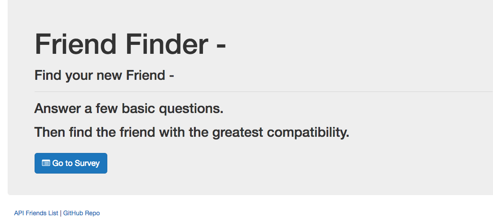
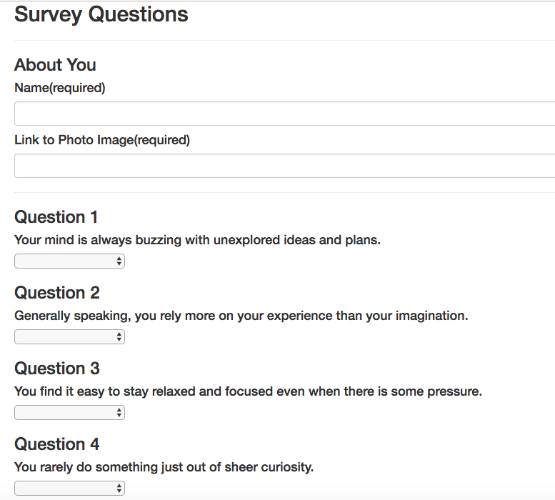
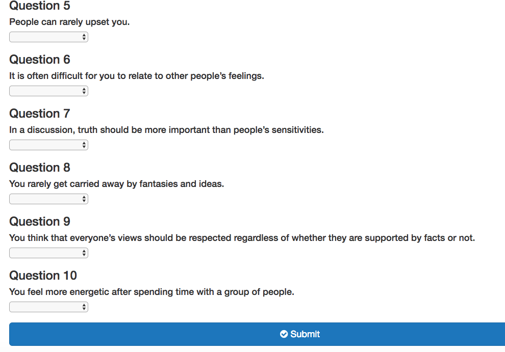
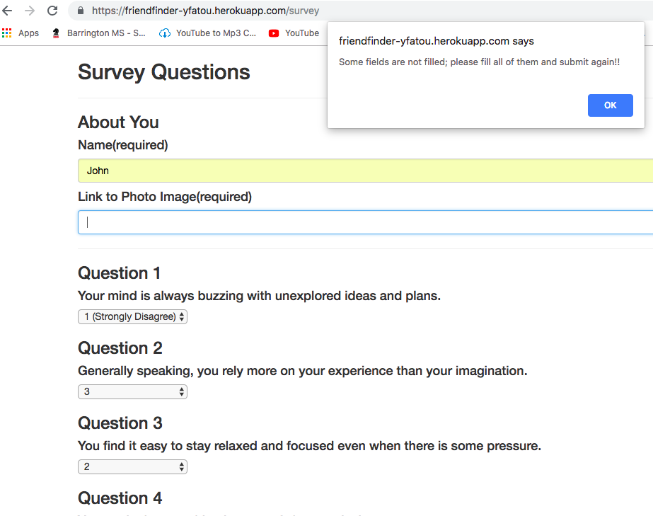
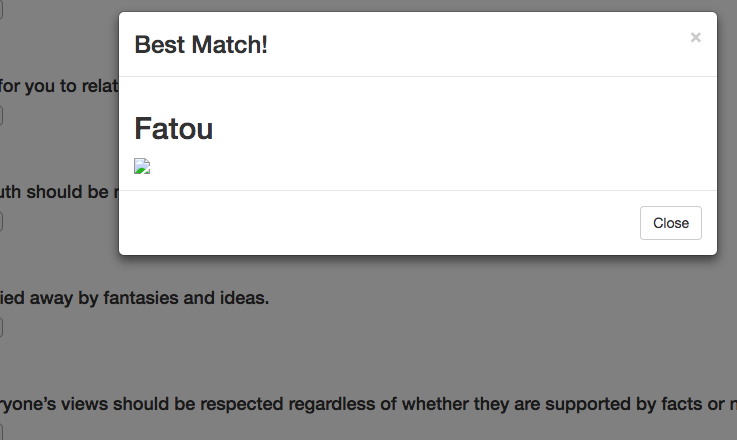

# FriendFinder

## Description
Welcome to FriendFinder.
This app will allows the user to find the next best frfiend.
To do so, the user will have to go to the homepage. 
Link to the deployed version of the app on Heroku: https://friendfinder-yfatou.herokuapp.com/

Once there, a click on "Take the survey" button will allows the user to access to a little survey to help find the best match.
All the fields are required.

If the user submit the survey without aswering to ALL the questions an alert will ask him to finish answering the question.

Once the user submit the survey, the name of the best match and a picture will be shown.

### How to find the best friend
To find the best match, a comparison between the current's user score and those from other users is done. 
All the differences are added and the best match will be the one with the least total difference.

## Technologies used
* Javascript
* JQuery
* Node js
* Express
* Bootstrap
* HTML
   

## Future developments
There is a bug in the link to show the picture of the best match.
For a better use of the app, it would be  great to display the homepage once the best match is displayed to the user.

